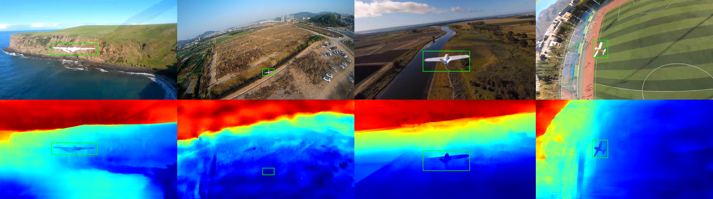
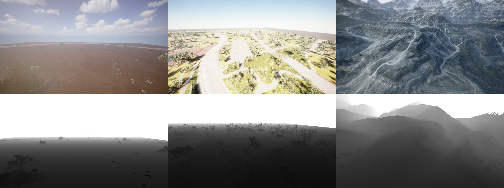

# Reconstructed and Simulated Dataset for Aerial RGBD Tracking

This is an implementation of the paper [Reconstructed and Simulated Dataset for Aerial RGBD Tracking](https://ieeexplore.ieee.org/document/10829654)

### Introduction

This study focuses on improving aerial target tracking in UAV applications. We introduce a new dataset called the Reconstructed and Simulated Aerial RGBD Tracking Dataset (RSTrack). The dataset is created by adding depth estimations to an existing aerial dataset. We also enhance this dataset with simulated environments. RSTrack contains 209 sequences and over 247K frames.





### Dataset

Coming soon...

### Citation
```
@ARTICLE{10829654,
  author={Liang, Juntao and Zhou, Jiaqi and Li, Wei and Wang, Yong and Hu, Tianjiang and Wu, Qi},
  journal={IEEE Robotics and Automation Letters}, 
  title={Reconstructed and Simulated Dataset for Aerial RGBD Tracking}, 
  year={2025},
  doi={10.1109/LRA.2025.3526565}}
```

### License

This project is under the MIT license.